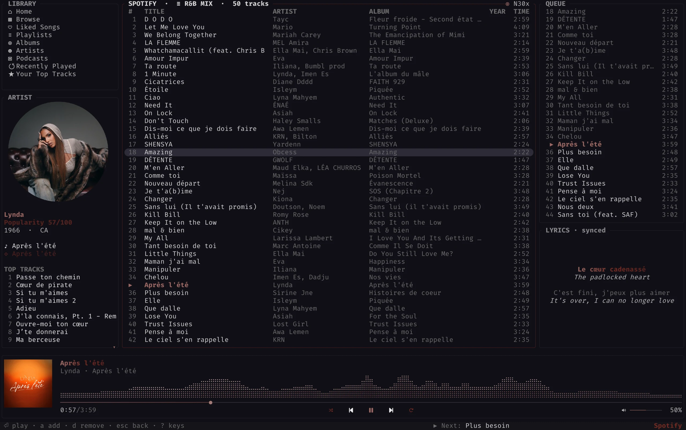
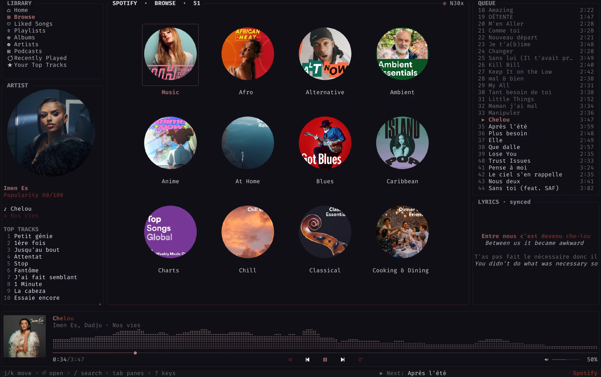
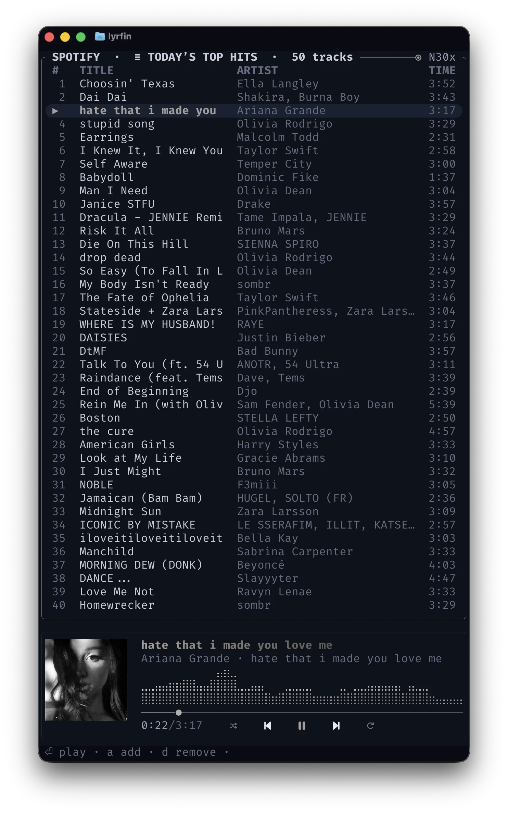
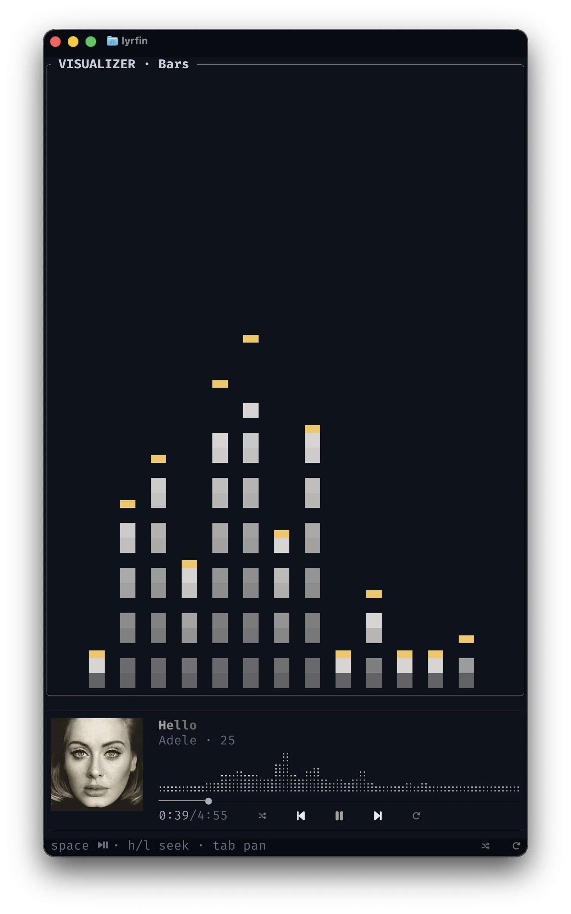
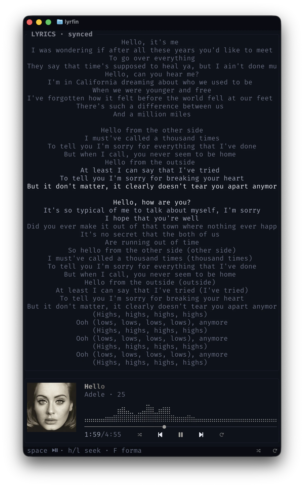
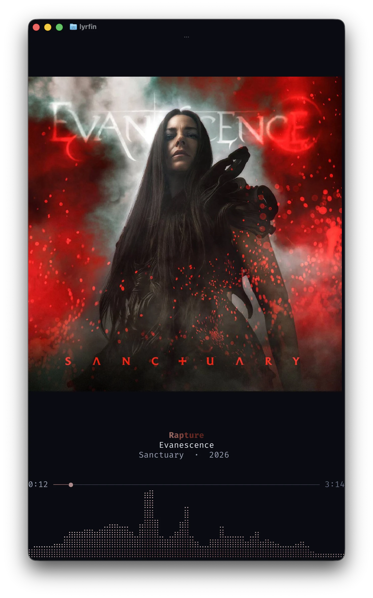

<div align="center">

<h1>
  
  &nbsp;lyrfin
</h1>

A modern, keyboard-first terminal music player — local library, Spotify, radio,
podcasts, synced lyrics, and a live visualizer, all in your terminal.

[](https://github.com/dilmun/lyrfin/actions/workflows/ci.yml)
[](LICENSE)
[](https://www.rust-lang.org)
[](https://github.com/sponsors/dilmun)

<br />

<picture>
  <source media="(prefers-color-scheme: dark)"  srcset="docs/screenshots/dark/hero.webp">
  <source media="(prefers-color-scheme: light)" srcset="docs/screenshots/light/hero.webp">
  
</picture>

<sub>Everything in one view — and it follows your terminal's light or dark theme.</sub>

</div>

<div align="right">
<details>
<summary>See more screenshots</summary>

<div align="center">

<br />

<table>
  <tr>
    <td colspan="2" align="center">
      <picture>
        <source media="(prefers-color-scheme: dark)"  srcset="docs/screenshots/dark/browse.webp">
        <source media="(prefers-color-scheme: light)" srcset="docs/screenshots/light/browse.webp">
        
      </picture>
      <br /><sub><b>Browse</b> — genres and moods as a cover wall</sub>
    </td>
  </tr>
  <tr>
    <td width="50%" align="center">
      <picture>
        <source media="(prefers-color-scheme: dark)"  srcset="docs/screenshots/dark/playlist.webp">
        <source media="(prefers-color-scheme: light)" srcset="docs/screenshots/light/playlist.webp">
        
      </picture>
      <br /><sub><b>Playlists &amp; search</b> — keyboard-driven track lists</sub>
    </td>
    <td width="50%" align="center">
      <picture>
        <source media="(prefers-color-scheme: dark)"  srcset="docs/screenshots/dark/visualizer.webp">
        <source media="(prefers-color-scheme: light)" srcset="docs/screenshots/light/visualizer.webp">
        
      </picture>
      <br /><sub><b>Visualizer</b> — live FFT spectrum</sub>
    </td>
  </tr>
  <tr>
    <td width="50%" align="center">
      <picture>
        <source media="(prefers-color-scheme: dark)"  srcset="docs/screenshots/dark/lyrics.webp">
        <source media="(prefers-color-scheme: light)" srcset="docs/screenshots/light/lyrics.webp">
        
      </picture>
      <br /><sub><b>Synced lyrics</b> — karaoke and translation</sub>
    </td>
    <td width="50%" align="center">
      <picture>
        <source media="(prefers-color-scheme: dark)"  srcset="docs/screenshots/dark/cover.webp">
        <source media="(prefers-color-scheme: light)" srcset="docs/screenshots/light/cover.webp">
        
      </picture>
      <br /><sub><b>Full-screen album art</b></sub>
    </td>
  </tr>
</table>

<sub>Captured on <a href="https://ghostty.org">Ghostty</a>, which renders real inline album art.</sub>

</div>
</details>
</div>

---

## Features

**Library**
- Off-thread scanner with a binary cache for instant cold starts
- Plays FLAC, MP3, AAC/M4A, OGG, and WAV (symphonia)
- Fuzzy search, Miller-column browsing (Artists ▸ Albums ▸ Tracks), multi-key sort
- Favorites, 0–5★ ratings, play counts, and smart lists
- Cover-art grid — album & artist wall with real covers and online artist photos

**Playback**
- symphonia → cpal engine on a dedicated thread with a lock-free ring buffer
- 10-band graphic equalizer with a preamp and presets
- Gapless, crossfade, ReplayGain, and time-stretched speed
- Reorderable queue, repeat, and shuffle

**Streaming & online**
- Spotify (Premium) via librespot, routed through lyrfin's own engine — the
  visualizer, volume, and speed all apply; browse, search, playlists, and likes
- Internet radio — ~50k Radio Browser stations with search, filters, and favorites
- Podcasts stream from their public RSS feeds

**Lyrics & visuals**
- Synced `.lrc` (sidecar or embedded), with online fallback (LRCLIB, NetEase, JioSaavn)
- Karaoke word-wipe, teleprompter, bilingual view, and machine translation
- Live FFT visualizer with multiple modes and a waterfall history
- Inline album art via Kitty, sixel, or iTerm2 — half-block fallback elsewhere

**Interface**
- 7 instantly-switchable layouts; movable, dockable panes; responsive collapse
- 13 themes with optional follow-the-system light/dark, plus custom TOML and an
  album-art accent
- Full mouse support, rebindable keys, session restore, and listening stats
- Built-in tag editor for a track or a whole album, with online auto-tagging

---

## Install

### Prebuilt binaries

Grab your platform's build from the
[**Releases**](https://github.com/dilmun/lyrfin/releases) page — Linux x86-64,
macOS (Intel & Apple Silicon), and Windows x86-64 — then:

```sh
tar xzf lyrfin-<target>.tar.gz
./lyrfin
```

> [!NOTE]
> **macOS Gatekeeper.** The binaries aren't notarized, so clear the quarantine
> flag once: `xattr -d com.apple.quarantine ./lyrfin`

### From source

Requires **Rust 1.96+**. On Linux, install ALSA headers first
(`sudo apt-get install libasound2-dev`).

```sh
cargo install --git https://github.com/dilmun/lyrfin
```

---

## Quick start

```sh
lyrfin                       # launch with your configured library
lyrfin ~/Music               # scan a folder for this session
lyrfin --theme cyberpunk     # start with a specific theme
```

Press <kbd>?</kbd> for help, <kbd>;</kbd> for settings, <kbd>e</kbd> for the
equalizer, and <kbd>7</kbd> to connect Spotify.

> [!IMPORTANT]
> lyrfin is developed on [Ghostty](https://ghostty.org) and also verified on
> **iTerm2** and **WezTerm** (macOS), including inline album art. It targets common standards
> (truecolor, inline images, Unicode) and should work on other modern terminals,
> but those aren't officially verified yet.

---

## Configuration

Config lives at `~/.config/lyrfin/config.toml` (`%APPDATA%\lyrfin` on Windows),
created with sensible defaults on first run. Most options are editable in-app via
the settings popup (<kbd>;</kbd>).

```toml
theme        = "aurora"              # or: cyberpunk · glacier · monolith · <custom>
music_dirs   = ["/home/you/Music"]
volume       = 72                    # 0–100
gapless      = true
crossfade_ms = 0                     # 0 disables
album_art    = true                  # inline cover art
```

Full reference — every field, the theme format, and data paths — in
[`docs/CONFIGURATION.md`](docs/CONFIGURATION.md).

---

## Keybindings

Essentials (all rebindable — full list in [`docs/KEYBINDINGS.md`](docs/KEYBINDINGS.md)):

| Key | Action | | Key | Action |
|-----|--------|-|-----|--------|
| <kbd>Space</kbd> | Play / pause | | <kbd>1</kbd>–<kbd>7</kbd> | Switch view |
| <kbd>n</kbd> / <kbd>p</kbd> | Next / previous | | <kbd>/</kbd> | Search |
| <kbd>,</kbd> / <kbd>.</kbd> | Seek back / forward | | <kbd>Tab</kbd> | Cycle pane focus |
| <kbd>-</kbd> / <kbd>+</kbd> | Volume | | <kbd>Enter</kbd> | Play / open |
| <kbd>j</kbd> / <kbd>k</kbd> | Move down / up | | <kbd>e</kbd> | Equalizer |
| <kbd>h</kbd> / <kbd>l</kbd> | Focus pane left / right | | <kbd>t</kbd> | Cycle theme |
| <kbd>s</kbd> / <kbd>r</kbd> | Shuffle / repeat | | <kbd>v</kbd> | Visualizer mode |
| <kbd>f</kbd> | Favorite | | <kbd>;</kbd> | Settings |
| <kbd>(</kbd> / <kbd>)</kbd> | Rate down / up | | <kbd>?</kbd> / <kbd>q</kbd> | Help / quit |

---

## Roadmap

- [ ] Broader terminal support (Ghostty, iTerm2 and WezTerm verified; Kitty,
      Alacritty, foot, and Windows Terminal still to go)
- [ ] Workspace profiles — switchable config / layout / library sets
- [ ] Scripting hooks (Lua or Rhai) for automation
- [ ] User-defined custom panes

Full detail and shipped milestones in [`docs/ROADMAP.md`](docs/ROADMAP.md).

---

## Contributing

Contributions are welcome. See [`CONTRIBUTING.md`](CONTRIBUTING.md) for the
workflow and conventions, and [`docs/ARCHITECTURE.md`](docs/ARCHITECTURE.md) for
the design (Event → Action → update → render).

```sh
cargo build --profile fast     # optimized, fast to rebuild — best for dev
cargo test                     # reducer + snapshot tests (headless)
cargo fmt --all --check        # formatting
cargo clippy --all-targets -- -D warnings   # lint
```

If lyrfin is useful to you, a [sponsorship](https://github.com/sponsors/dilmun)
or a ⭐ helps it keep going.

---

## License

[MIT](LICENSE) © 2026 dilmun.

<sub>lyrfin is an independent project and is not affiliated with or endorsed by Spotify, Apple, Deezer, or any other service it interoperates with. Built on ratatui, symphonia, cpal, librespot, lofty, nucleo, and rustfft — thank you to those projects.</sub>
